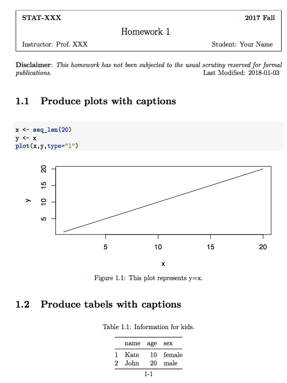
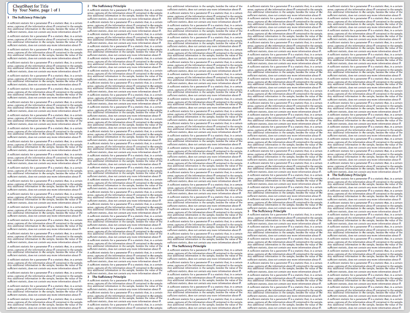

# templates-for-LaTex-and-Rmd
This repositorie contains self-modified Rmd and LaTex templates.

1. The template `Cheatsheet` is adpated from [here](https://tex.stackexchange.com/questions/218587/how-to-set-one-header-for-each-page-using-multicols).

2. Templates `Homework` and `Lecture-notes` are adpated from [here](https://www.cs.cmu.edu/~ggordon/10725-F12/template.tex).

## Install

There's no need to install. 

- To make a cheatsheet, just use the `main.tex`. A minimal example is given in the folder  `sample`.
- To write lecture notes or homework, follow the instructions given in `exmaple.Rmd` files.

## Quick Preview

- homework
    

- cheatsheet
    

